# Database Project[^1]

## POSTGRESQL 工作流程[^2]

### PostgreSQL的结构

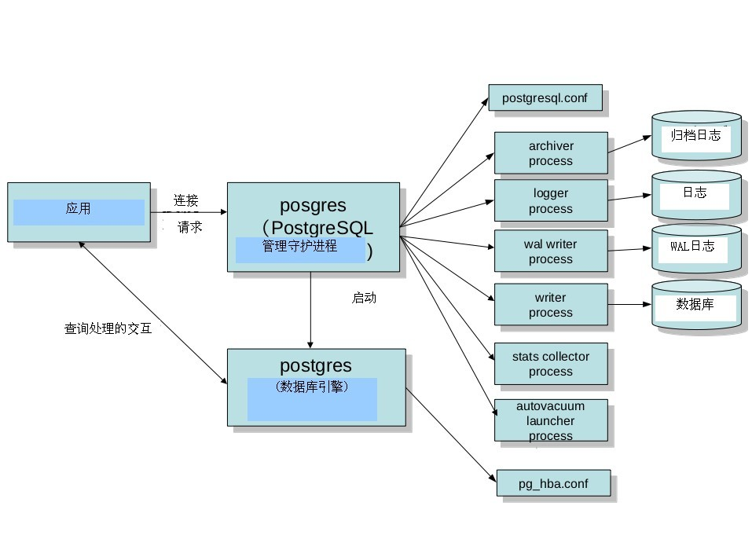

#### Potgres 常驻进程

管理后端的常驻进程，也称为’postmaster’。其默认监听UNIX Domain Socket和TCP/IP（Windows等，一部分的平台只监听tcp/ip）的5432端口，等待来自前端的的连接处理。监听的端口号可以在PostgreSQL的设置文件postgresql.conf里面可以改。

一旦有前端连接过来，postgres会通过fork(2)生成子进程。没有Fork(2)的windows平台的话，则利用createProcess()生成新的进程。这种情形的话，和fork(2)不同的是，父进程的数据不会被继承过来，所以需要利用共享内存把父进程的数据继承过来。

#### Postgres 子进程

子进程根据pg_hba.conf定义的安全策略来判断是否允许进行连接，根据策略，会拒绝某些特定的IP及网络，或者也可以只允许某些特定的用户或者对某些数据库进行连接。

Postgres会接受前端过来的查询，然后对数据库进行检索，最好把结果返回，有时也会对数据库进行更新。更新的数据同时还会记录在事务日志里面（PostgreSQL称为WAL日志），这个主要是当停电的时候，服务器当机，重新启动的时候进行恢复处理的时候使用的。另外，把日志归档保存起来，可在需要进行恢复的时候使用。在PostgreSQL 9.0以后，通过把WAL日志传送其他的postgreSQL，可以实时得进行数据库复制，这就是所谓的‘数据库复制’功能。

##### 其他进程

###### Writer process

Writer process在适当的时间点把共享内存上的缓存写往磁盘。通过这个进程，可以防止在检查点的时候(checkpoint),大量的往磁盘写而导致性能恶化，使得服务器可以保持比较稳定的性能。Background writer起来以后就一直常驻内存，但是并非一直在工作，它会在工作一段时间后进行休眠，休眠的时间间隔通过postgresql.conf里面的参数bgwriter_delay设置，默认是200微秒。

这个进程的另外一个重要的功能是定期执行检查点(checkpoint)。

检查点的时候，会把共享内存上的缓存内容往数据库文件写，使得内存和文件的状态一致。通过这样，可以在系统崩溃的时候可以缩短从WAL恢复的时间，另外也可以防止WAL无限的增长。 可以通过postgresql.conf的checkpoint_segments、checkpoint_timeout指定执行检查点的时间间隔。

###### WAL writer process

WAL writer process把共享内存上的WAL缓存在适当的时间点往磁盘写，通过这样，可以减轻后端进程在写自己的WAL缓存时的压力，提高性能。另外，非同步提交设为true的时候，可以保证在一定的时间间隔内，把WAL缓存上的内容写入WAL日志文件。

###### Archive process

Archive process把WAL日志转移到归档日志里。如果保存了基础备份以及归档日志，即使实在磁盘完全损坏的时候，也可以回复数据库到最新的状态。

###### stats collector process

统计信息的收集进程。收集好统计表的访问次数，磁盘的访问次数等信息。收集到的信息除了能被autovaccum利用，还可以给其他数据库管理员作为数据库管理的参考信息。

###### Logger process

把postgresql的活动状态写到日志信息文件（并非事务日志），在指定的时间间隔里面，对日志文件进行rotate.

###### Autovacuum 启动进程

autovacuum launcher process是依赖于postmaster间接启动vacuum进程。而其自身是不直接启动自动vacuum进程的。通过这样可以提高系统的可靠性。

###### 自动 vacuum 进程

autovacuum worker process进程实际执行vacuum的任务。有时候会同时启动多个vacuum进程。

###### wal sender / wal receiver

wal sender 进程和wal receiver进程是实现postgresql复制(streaming replication)的进程。Wal sender进程通过网络传送WAL日志，而其他PostgreSQL实例的wal receiver进程则接收相应的日志。Wal receiver进程的宿主PostgreSQL（也称为Standby）接受到WAL日志后，在自身的数据库上还原，生成一个和发送端的PostgreSQL(也称为Master)完全一样的数据库。

##### 后端的处理流程

下面看看数据库引擎postgres子进程的处理概要。为了简单起见下面的说明中，把backend process简称为backend。Backend的main函数是PostgresMain (tcop/postgres.c)。

1. 接收前端发送过来的查询(SQL文)
2. SQL文是单纯的文字，电脑是认识不了的，所以要转换成比较容易处理的内部形式构文树parser tree,这个处理的称为构文解析。构文解析的模块称为parser.这个阶段只能够使用文字字面上得来的信息，所以只要没语法错误之类的错误，即使是select不存在的表也不会报错。这个阶段的构文树被称为raw parse tree. 构文处理的入口在raw_parser (parser/parser.c)。
3. 构文树解析完以后，会转换为查询树(Query tree)。这个时候，会访问数据库，检查表是否存在，如果存在的话，则把表名转换为OID。这个处理称为分析处理(Analyze), 进行分析处理的模块是analyzer。 另外，PostgreSQL的代码里面提到构文树parser tree的时候，更多的时候是指查询树Query tree。分析处理的模块的入口在parse_analyze (parser/analyze.c)
4. PostgreSQL还通过查询语句的重写实现视图(view)和规则(rule), 所以需要的时候，在这个阶段会对查询语句进行重写。这个处理称为重写(rewrite)，重写的入口在QueryRewrite (rewrite/rewriteHandler.c)。
5. 通过解析查询树，可以实际生成计划树。生成查询树的处理称为‘执行计划处理’，最关键是要生成估计能在最短的时间内完成的计划树(plan tree)。这个步骤称为’查询优化’(不叫query optimize, 而是optimize), 而完成这个处理的模块称为查询优化器(不叫query optimizer,而是optimizer, 或者称为planner)。执行计划处理的入口在standard_planner (optimizer/plan/planner.c)。
6. 按照执行计划里面的步骤可以完成查询要达到的目的。运行执行计划树里面步骤的处理称为执行处理‘execute’, 完成这个处理的模块称为执行器‘Executor’, 执行器的入口地址为，ExecutorRun (executor/execMain.c)
7. 执行结果返回给前端。
8. 返回到步骤一重复执行。

#### PostgreSQL 源码结构

##### 第一级目录结构

进入PostgreSQL的源码目录后，第一级的结构如下表所示。在这一级里，通过执行如下命令configure;make;make install可以立即进行简单的安装

    文件目录         说明
    COPYRIGHT       版权信息
    GUNMakefile     第一级目录的 Makefile
    GUNMakefile.in  Makefile 的雏形
    HISTORY         修改历史
    INSTALL         安装方法简要说明
    Makefile        Makefile模版
    README          简单说明
    aclocal.m4      config 用的文件的一部分
    config/         config 用的文件的目录
    configure       configure 文件
    configure.in    configure 文件的雏形
    contrib/        contribution 程序
    doc/            文档目录
    src/            源代码目录

PostgreSQL 的src下面有。

```
DEVELOPERS          面向开发人员的注视
Makefile            Makefile 
Makefile.global     make 的设定值（从configure生成的）
Makefile.global.in  Configure使用的Makefile.global的雏形
Makefile.port       平台相关的make的设定值，实际是一个到makefile/Makefile的连接. （从configure生成的）
Makefile.shlib      共享库用的Makefile
backend/            后端的源码目录
bcc32.mak
bin/                psql 等 UNIX命令的代码
include/            头文件
interfaces/         前端相关的库的代码
makefiles/          平台相关的make 的设置值
nls-global.mk       信息目录用的Makefile文件的规则
pl/                 存储过程语言的代码
port/               平台移植相关的代码
template/           平台相关的设置值
test/               各种测试脚本
timezone/           时区相关代码
tools/              各自开发工具和文档
tutorial/           教程
win32.mak
```

这里比较核心的是backend,bin,interface这几个目录。Backend是对应于后端，bin和interface对应于前端。

bin里面有pgsql,initdb,pg_dump等各种工具的代码。interface里面有PostgreSQL的C语言的库libpq,另外可以在C里嵌入SQL的ECPG命令的相关代码。

Backend目录的结构如下：

```
目录文件            说明
Makefile           makefile
access/
    各种存储访问方法(在各个子目录下)
    common(共同函数)
    gin (Generalized Inverted Index通用逆向索引)
    gist (Generalized  Search Tree通用索引)
    hash (哈希索引)
    heap (heap的访问方法)
    index (通用索引函数)
    nbtree (Btree函数)
    transam (事务处理)
bootstrap/          数据库的初始化处理(initdb的时候)
catalog/            系统目录
commands/           SELECT/INSERT/UPDATE/DELETE以为的SQL文的处理
executor/           执行器(访问的执行)
foreign/            FDW(Foreign Data Wrapper)处理
lib/                共同函数
libpq/              前端/后端通信处理
main/               postgres的主函数
nodes/              构文树节点相关的处理函数
optimizer/          优化器
parser/             SQL构文解析器
port/               平台相关的代码
postmaster/         postmaster的主函数 (常驻postgres)
replication/        streaming replication
regex/              正则处理
rewrite/            规则及视图相关的重写处理
snowball/           全文检索相关（语干处理）
storage/
    共享内存、磁盘上的存储、缓存等全部一次/二次记录管理(以下的目录)
    buffer/(缓存管理)
    file/(文件)
    freespace/(Fee Space Map管理)
    ipc/(进程间通信)
    large_object /(大对象的访问函数)
    lmgr/(锁管理)
    page/(页面访问相关函数)
    smgr/(存储管理器)
tcop/               postgres (数据库引擎的进程)的主要部分
tsearch/            全文检索
utils/
    各种模块(以下目录)
    adt/(嵌入的数据类型)
    cache/(缓存管理)
    error/(错误处理)
    fmgr/(函数管理)
    hash/(hash函数)
    init/(数据库初始化、postgres的初期处理)
    mb/(多字节文字处理)
    misc/(其他)
    mmgr/(内存的管理函数)
    resowner/(查询处理中的数据(buffer pin及表锁)的管理)
    sort/(排序处理)
    time/(事务的 MVCC 管理)
```

backend等的代码的头文件包含在include里面。其组织虽然与backend的目录结构类似，但是并非完全相同，基本上来说下一级的子目录不再设下一级目录。例如backend的目录下面有utils这个目录，而util下面还有adt这个子目录，但是include里面省略了这个目录，变成了扁平的结构。

```
access/
bootstrap/
c.h
catalog/
commands/
dynloader.h
executor/
fmgr.h
foreign/
funcapi.h
getaddrinfo.h
getopt_long.h
lib/
libpq/
mb/
miscadmin.h
nodes/
optimizer/
parser/
pg_config.h
pg_config.h.in
pg_config.h.win32
pg_config_manual.h
pg_config_os.h
pg_trace.h
pgstat.h
pgtime.h
port/
port.h
portability/
postgres.h
postgres_ext.h
postgres_fe.h
postmaster/
regex/
rewrite/
rusagestub.h
snowball/
stamp-h
storage/
tcop/
tsearch/
utils/
windowapi.h
```

## Part1

### Levenshtein Distance

Levenshtein distance 算法（中文名：莱文斯坦距离算法或编辑距离算法）由苏联数学家Vladimir Levenshtein于1965年提出，它以对一个字符串每步插入、删除或替换一个字符，是之变成另一个字符串所需要的最小步骤数度量这两个字符串的“距离”，也因此得名“编辑距离算法”。

1. 算法思路
    - 步骤解释
        Levenshtein distance 算法中，每次对字符串可以进行插入、删除或替换一个字符，通过一些例子可以更好理解。
        - 将 sun 转化为 son 只需要将 u 替换为 o，因此 sun 和 son 之间的Levenshtein 距离为 1。
        - 将 sun 转化为 sunday 需要插入 d、a、y 三个字符，因此 sun 和 sunday 之间的Levenshtein 距离为 3。
        - 同理，将 sunday 转化为 sun 需要删除 d、a、y 三个字符，因此 sunday 和 sun 之间的Levenshtein 距离也为 3。
    - 核心逻辑
        ${\displaystyle \qquad \operatorname {lev} _{a,b}(i,j)={\begin{cases}\max(i,j)&{\text{ if }}\min(i,j)=0,\\\min {\begin{cases}\operatorname {lev}_{a,b}(i-1,j)+1\\\operatorname {lev} _{a,b}(i,j-1)+1\\\operatorname {lev}_{a,b}(i-1,j-1)+1_{(a_{i}\neq b_{j})}\end{cases}}&{\text{ otherwise.}}\end{cases}}}$
        - 初始化一个`table`矩阵`(M,N)`，`M`和`N`分别是两个输入字符串的长度
        - 矩阵可以从左上角到右下角进行填充，每个水平或垂直跳转分别对应于一个插入或一个删除通过定义每个操作的成本为1，如果两个字符串不匹配，则对角跳转的代价为1，否则为0，简单来说就是：
          - 如果`[i][j]`位置的两个字符串相等，则从`[i][j]`位置左加1，上加1，左上加0，然后从这三个数中取出最小的值填充到`[i][j]`
          - 如果`[i][j]`位置的两个字符串不相等，则从`[i][j]`位置左、左上、上三个位置的值中取最小值，这个最小值加1（或者说这三个值都加1然后取最小值），然后填充到`[i][j]`
        - 按照上面规则`Table`矩阵`(M,N)`填充完毕后，最终矩阵右下角的数字就是两个字符串的`Levenshtein Distance`值 
    - 更多内容可以参阅这个[视频](https://www.youtube.com/watch?v=MiqoA-yF-0M)

2. 过程中的种种问题
    * `text`转换问题
        我们首先来研究一下这个 `text` 的实现，我们在源码中找到了这样的代码

        ```c
        typedef struct varlena text;
        struct varlena{
        char    vl_len_[4];     /* Do not touch this field directly! */
        char    vl_dat[1];
        };
        ```

        在研究源码后，可以确定`vl_dat`就是string了， 于是尝试使用如下方法

        ```c
        text * str_01 = PG_GETARG_DATUM(0);
        text *txt_02 = PG_GETARG_DATUM(1);
        int32 result=1;
        char *str1 = str_01->vl_dat;
        char *str2 = txt_02->vl_dat;
        int len_1 = strlen(str1);
        int len_2 = strlen(str2);
        ```

        运行后发现如图情况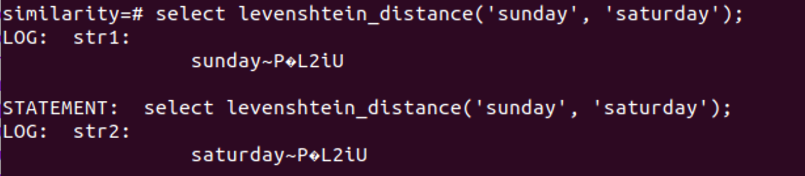

        我们发现在字符串后面加上了不需要的内容，因此需要另寻出路。在研究 text 结构的时候我们发现了 `text_to_cstring()` 函数，于是转而采用此函数实现将`text`的转化，代码如下

        ```c
        text * str_01 = PG_GETARG_DATUM(0);
        text *txt_02 = PG_GETARG_DATUM(1);
        int32 result=1;
        char *str1 = text_to_cstring(str_01);
        char *str2 = text_to_cstring(txt_02);
        int len_1 = strlen(str1);
        int len_2 = strlen(str2);
        ```

3. 代码解释
    - 代码总览

        ```c
        int min(int a, int b, int c){
            int reslut = a;
            if ( a > b){
                reslut = b;
                if (b > c)
                    reslut = c;
            }
            else if(a > c)
                reslut = c;
            return reslut;
        }

        char TOLOWER(char c){
            if(c >= 'A' && c <= 'Z')
                c += 32;
            return c;
        }

        Datum levenshtein_distance(PG_FUNCTION_ARGS){
            text * str_01 = PG_GETARG_DATUM(0);
            text *txt_02 = PG_GETARG_DATUM(1);
            int32 result=1;
            // text to char c
            char *str1 = text_to_cstring(str_01);
            char *str2 = text_to_cstring(txt_02);
            int len_1 = strlen(str1);
            int len_2 = strlen(str2);
            int table[256][256];
            int i, j;
            //debug part
            elog(LOG, "str1:\n\t%s\n", str1);
            elog(LOG, "str2:\n\t%s\n", str2);
            elog(LOG, "len1:\n\t%d\n", len_1);
            elog(LOG, "len2:\n\t%d\n", len_2);
            for(i = 1;i <= len_1; ++i)
                table[i][0] = i;
            for(i = 1; i <= len_2; ++i)
                table[0][i] = i;
            for(j = 1; j <= len_2; ++j )
                for(i = 1; i <= len_1; ++i){
                    if(TOLOWER(str1[i-1]) == TOLOWER(str2[j-1]))
                        table[i][j] = table[i-1][j-1];
                    else
                        table[i][j] = min(table[i-1][j-1], table[i-1][j], table[i][j-1]) + 1;
                }
            result = table[len_1][len_2];
            PG_RETURN_INT32(result);
        }
        ```

    - 功能说明
        - `int min(int a, int b, int c)`
            用来计算三者中最小值
        - `char TOLOWER(char c)`
            用来将大写字符转换成小写，即实现了大小写不敏感对需求。在之后的 Jaccard Index 中我们也会用到这个函数
        - `Datum levenshtein_distance(PG_FUNCTION_ARGS)`
            Levenshtein Distance 算法核心部分
4. 结果展示
    - `select levenshtein_distance('sunday', 'sunday');`
        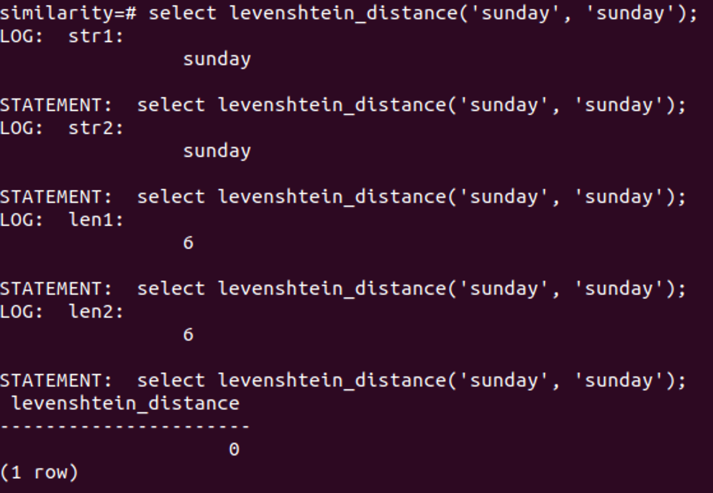
    - `select levenshtein_distance('sunday', 'Monday'); levenshtein_distance`
        
    - `select levenshtein_distance('sunday', 'saturday');`
        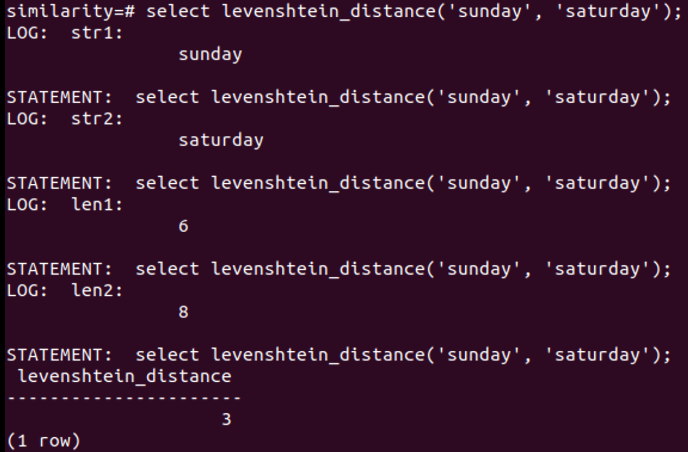
    - `select count(*) from restaurantphone rp, addressphone ap where levenshtein_distance(rp.phone, ap.phone) < 4;`
        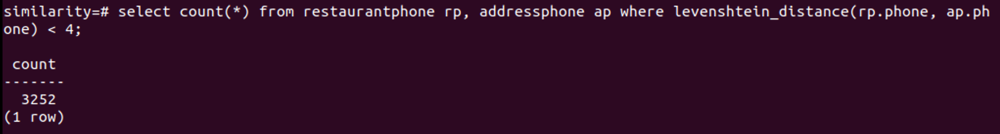
    - `select count(*) from restaurantaddress ra, restaurantphone rp where levenshtein_distance(ra. name, rp. name) < 3;`
        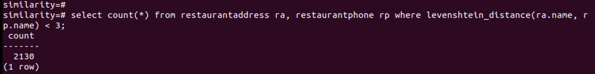
    - `select count(*) from restaurantaddress ra, addressphone ap where levenshtein_distance(ra.address, ap.address) < 4;`
        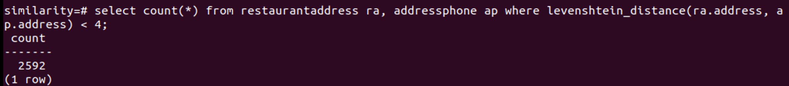
    - ```sql
      SELECT ra.address, ap.address, ra.name, ap.phone
      FROM restaurantaddress ra, addressphone ap
      WHERE levenshtein_distance(ra.address, ap.address) < 4 AND
          (ap.address LIKE '%Berkeley%' OR ap.address LIKE '%Oakland%') ORDER BY 1, 2, 3, 4;
      ```
        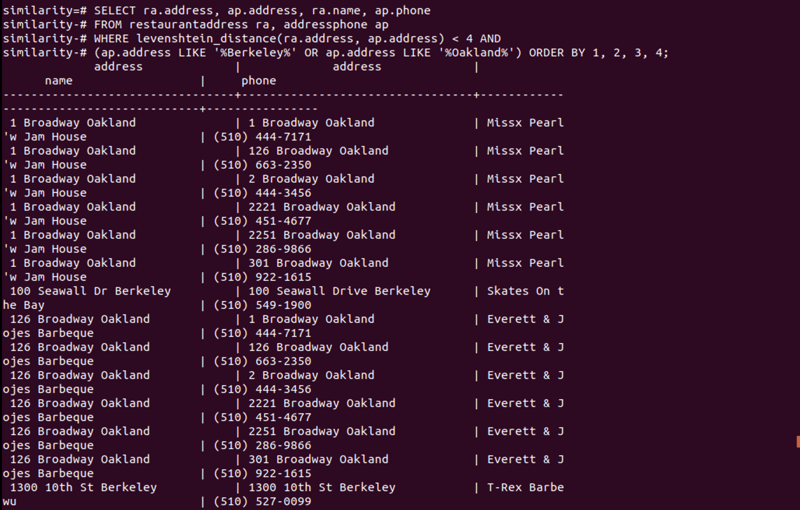
        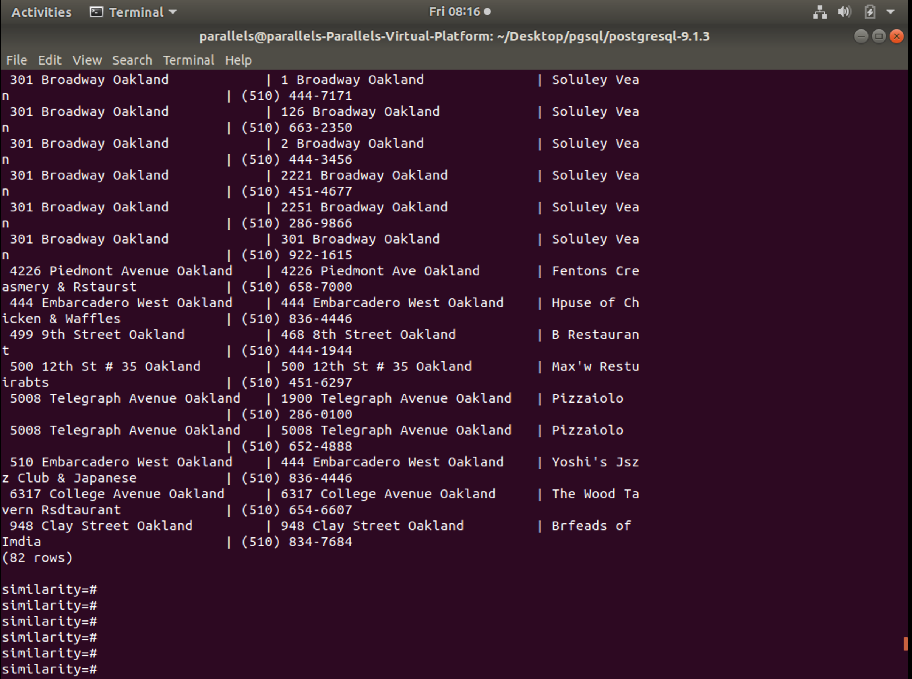

### Jaccard Index

1. 算法思路
   - Jaccard相似指数用来度量两个集合之间的相似性，它被定义为两个集合交集的元素个数除以并集的元素个数:
        $J(A,B) = {{|A \cap B|}\over{|A \cup B|}} = {{|A \cap B|}\over{|A| + |B| - |A \cap B|}}$
        (若 $A$ 和 $B$ 均为空集，则 $J(A,B) = 1$)
        $0\le J(A,B)\le 1$
   - 在这个算法中，我们用两个个字符串的二元划分集来计算 Jaccard 相似指数。所谓二元划分集，就是将一个字符串首尾都加上`$`，然后从头部开始每两个字符组成一个二元组。例如，`apple`对应的二元划分集为{`$a`, `ap`, `pp`, `pl`, `le`, `e$`}，`apply`对应的二元划分集为{`$a`, `ap`, `pp`, `pl`, `ly`, `y$`}，两个二元划分集的交集为{`$a`, `ap`, `pp`, `pl`}，并集为{`$a`, `ap`, `pp`, `pl`, `le`, `e$`, `ly`, `y$`}。因此`apple`和`apply`的 Jaccard 相似指数为 0.5
   - 在本次实验中，我们将 Jaccard Index 函数的是实现分为三个阶段：
     - getbigagran:
        本阶段即为取得字符串的两元切分的不重复集合，思路为利用`int tag[]`数组记录集合元素第一个字符的位置，以此来保存相应元素；
        同时`tag`数组利用`cnt/result`“指针”顺序寄存元素字符位置数据，同时隐含的记录数据长度，同时作为返回值，告诉调用函数生成集合的大小；
        同时对 `tag` 值做一下规定
        - `tag[i] = -1` 表示字符串头部
        - `tag[i] = -2` 表示字符串尾部
        - `tag[i] = -3` 表示初始状况/没有标记
        - `tag[i] = 0,1...` 表示两元划分第一个字符在字符串里面的位置
     - inter:
        计算两个集合交的函数，非常质朴，采用暴力连接的方式（类似于 Nest Loop Join）
     - jaccard_index：
        主函数，利用容斥原理，利用集合元素总数减去交集元素总数 $|A| + |B| - |A \cap B|$ 得到两集合并集元素个数

2. 代码解释

    ```c
    /*---------------------------------------------------------------------
    *
    * 我们在 Jaccard Index 中也用到了 TOLOWER 函数，用于实现大小写不敏感
    * getbiagram 函数用于求出字符串的二元划分集
    * 第一个参数是字符串本身
    * 第二个参数是一个 tag 数组:
    * tag[i] = -1 表示字符串头部;
    * tag[i] = -2 表示字符串尾部;
    * tag[i] = -3 表示没有标记（即初始情况）
    * 自然数表示二元划分的第一个字符在字符串中的位置
    * 返回值是该字符串二元划分集元素个数
    *
    *-----------------------------------------------------------------------
    */
    int getbiagram(char *str, int *tag){
        int i, j, len = strlen(str), result = 1;
        tag[0] = -1;
        for (i = 1; i < 256; i++)
            tag[i] = -3;
        for (i = 0; i < len - 1; i++){
            for (j = 1; j < result; j++)
                if ((TOLOWER(str[i]) == TOLOWER(str[tag[j]])) && (TOLOWER(str[i + 1]) == TOLOWER(str[tag[j] + 1])))
                    break;
            if (j == result)
                tag[result++] = i;
        }
        tag[result++] = -2;
        return result;
    }
    ```

    ```c
    /*-----------------------------------------------------------------
    *
    * inter 函数用于求出两个集合的交集元素个数
    * 第一第二个参数是两个字符串，第三第四个参数是两个字符串分别对应的二元划分集
    * 返回值即为两个二元划分集交集的元素个数
    *
    *------------------------------------------------------------------
    */
    int inter(char *str1, char *str2, int *tag1, int *tag2){
        int i, j, cnt = 0;
        for (i = 0; i < 256 && tag1[i] != -3; i++){
            if (tag1[i] == -1)
                cnt += (TOLOWER(str1[0]) == TOLOWER(str2[0]) ? 1 : 0);
            else if (tag1[i] == -2)
                cnt += (TOLOWER(str1[strlen(str1) - 1]) == TOLOWER(str2[strlen(str2) - 1]) ? 1 : 0);
            else{
                for (j = 1; j < 256 && tag2[j] != -2; j++){
                    if ((TOLOWER(str1[tag1[i]]) == TOLOWER(str2[tag2[j]])) && (TOLOWER(str1[tag1[i] + 1]) == TOLOWER(str2[tag2[j] + 1])))
                        break;
                }
                if (tag2[j] != -2 && tag2[j] != -3)
                    cnt++;
            }
        }
        return cnt;
    }
    ```

    ```c
    /*-----------------------------------------------------------------
    *
    * Jaccard Index 算法，主要功能已经通过上面两个函数实现
    *
    *------------------------------------------------------------------
    */
    Datum jaccard_index(PG_FUNCTION_ARGS){
        text *str_01 = PG_GETARG_DATUM(0);
        text *txt_02 = PG_GETARG_DATUM(1);
        char* str1 = text_to_cstring(str_01);
        char* str2 = text_to_cstring(txt_02);
        int tag1[256], cnt_1;
        int tag2[256], cnt_2;
        cnt_1 = getbiagram(str1, tag1);
        cnt_2 = getbiagram(str2, tag2);
        int insec = inter(str1, str2, tag1, tag2);
        float result = (float)insec / (cnt_1 + cnt_2 - insec);
        PG_RETURN_FLOAT4(result);
    }
    ```

3. 新增算法
    *新增加的算法的改进主要在求解 getbiagram 上*
    - 新思路将二元划分的两个字符合成一个`int`即 `p1<<7+p2`
    - 将转成的数据作为`tag`数组的下标,并将`tag[p1<<7+p2] = 1`
    - 求集合并交操作通过遍历`tag`数组一次求的；

    ```c
    int getbiagram(char *str, int *tag){
        char p1, p2 = TOLOWER(str[0]);
        int len = strlen(str);
        int tmp, result = 2;
        tag[p2<<7] = true;
        for(int i = 1; i < len; ++i){
            p1 = p2;
            p2 = TOLOWER(str[i]);
            tmp = (p1<<7)+p2;
            if(!tag[tmp])
                ++result;
            tag[tmp] = true;
        }
        tag[p2] = true;
        return result;
    }

    Datum jaccard_index(PG_FUNCTION_ARGS){
        text *str_01 = PG_GETARG_DATUM(0);
        text *txt_02 = PG_GETARG_DATUM(1);
        char* str1 = text_to_cstring(str_01);
        char* str2 = text_to_cstring(txt_02);
        int tag1[1000000] = {};
        int tag2[1000000] = {};
        int max = 1 << 16;
        int uni, inter;
        uni = inter = 0;
        getbiagram(str1, tag1);
        getbiagram(str2, tag2);
        for(int i = 1; i < max; ++i){
            if(tag1[i] | tag2[i])
                ++uni;
            if(tag1[i] == tag2[i])
            ++inter;
        }
        float result = (inter * 1.0) / (uni * 1.0);
        PG_RETURN_FLOAT4(result);
    }
    ```

4. 遇到的问题
    - pdf 文件里面的 SQL 正则表达式竟然有空格导致我一直没法作出正确答案，最后在助教爸爸的提示下才发现这个问题
    - 时间太仓促，以至于没有时间去思考Part2的内容

5. 结果展示
    - `select count(*) from restaurantphone rp, addressphone ap where jaccard_index(rp.phone, ap.phone) > .6;`
        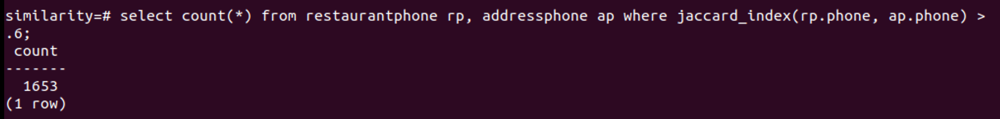
    - `select count(*) from restaurantaddress ra, restaurantphone rp where jaccard_index(ra.name, rp.name) > .65;`
        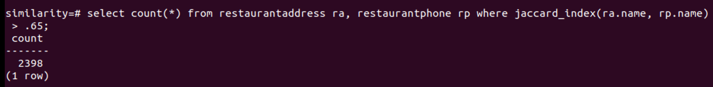
    - `select count(*) from restaurantaddress ra, addressphone ap where jaccard_index(ra.address, ap.address) > .8;`
        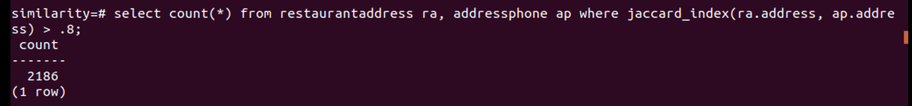
    - ```sql
      SELECT rp.phone, ap.phone, rp.name, ap.address
      FROM restaurantphone rp, addressphone ap
      WHERE jaccard_index(rp.phone, ap.phone) > .6 AND
          (ap.address LIKE '%Berkeley%' OR ap.address LIKE '%Oakland%') ORDER BY 1, 2, 3, 4;
      ```
      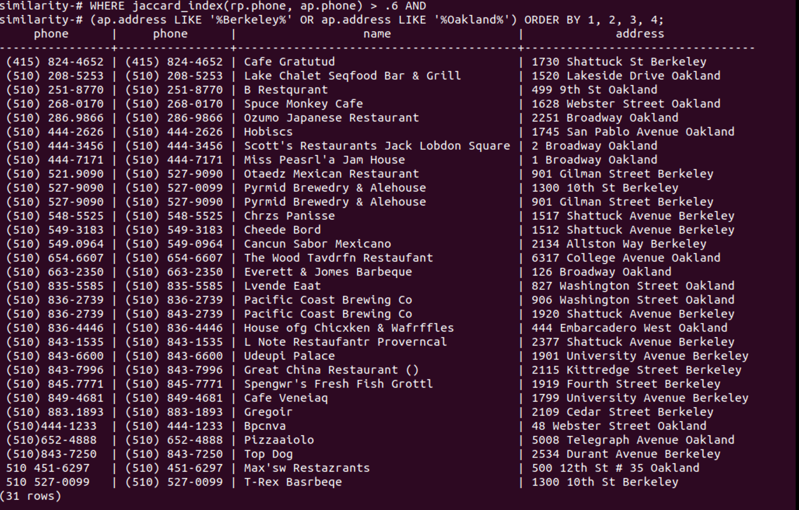
      *这里坑死我了，竟然要去空格，真的吐了*

## PART2

由于时间有限以及没有完全理解代码所以就没有做

[^1]:作业[Github](https://github.com/broodunivermonster/databese_final)
[^2]: 搬运自 [Pgsrcstructure](https://wiki.postgresql.org/wiki/Pgsrcstructure) 当然在理解的基础上...