# Database Project

## Part1

### Levenshtein Distance

Levenshtein distance 算法（中文名：莱文斯坦距离算法或编辑距离算法）由苏联数学家弗拉基米尔·莱文斯坦于1965年提出，它以对一个字符串每步插入、删除或替换一个字符，是之变成另一个字符串所需要的最小步骤数度量这两个字符串的“距离”，也因此得名“编辑距离算法”。

1. 算法思路
    - 步骤解释
        Levenshtein distance 算法中，每次对字符串可以进行插入、删除或替换一个字符，通过一些例子可以更好理解。
        - 将 sun 转化为 son 只需要将 u 替换为 o，因此 sun 和 son 之间的Levenshtein 距离为 1。
        - 将 sun 转化为 sunday 需要插入 d、a、y 三个字符，因此 sun 和 sunday 之间的Levenshtein 距离为 3。
        - 同理，将 sunday 转化为 sun 需要删除 d、a、y 三个字符，因此 sunday 和 sun 之间的Levenshtein 距离也为 3。
    - 核心逻辑
        ${\displaystyle \qquad \operatorname {lev} _{a,b}(i,j)={\begin{cases}\max(i,j)&{\text{ if }}\min(i,j)=0,\\\min {\begin{cases}\operatorname {lev}_{a,b}(i-1,j)+1\\\operatorname {lev} _{a,b}(i,j-1)+1\\\operatorname {lev}_{a,b}(i-1,j-1)+1_{(a_{i}\neq b_{j})}\end{cases}}&{\text{ otherwise.}}\end{cases}}}$
        - 初始化一个`table`矩阵`(M,N)`，`M`和`N`分别是两个输入字符串的长度
        - 矩阵可以从左上角到右下角进行填充，每个水平或垂直跳转分别对应于一个插入或一个删除通过定义每个操作的成本为1，如果两个字符串不匹配，则对角跳转的代价为1，否则为0，简单来说就是：
          - 如果`[i][j]`位置的两个字符串相等，则从`[i][j]`位置左加1，上加1，左上加0，然后从这三个数中取出最小的值填充到`[i][j]`
          - 如果`[i][j]`位置的两个字符串不相等，则从`[i][j]`位置左、左上、上三个位置的值中取最小值，这个最小值加1（或者说这三个值都加1然后取最小值），然后填充到`[i][j]`
        - 按照上面规则`Table`矩阵`(M,N)`填充完毕后，最终矩阵右下角的数字就是两个字符串的`Levenshtein Distance`值 
    - 更多内容可以参阅这个[视频](https://www.youtube.com/watch?v=MiqoA-yF-0M)

2. 过程中的种种问题
    * `text`转换问题
        我们首先来研究一下这个 `text` 的实现，我们在源码中找到了这样的代码

        ```c
        typedef struct varlena text;
        struct varlena{
        char    vl_len_[4];     /* Do not touch this field directly! */
        char    vl_dat[1];
        };
        ```

        在研究源码后，可以确定`vl_dat`就是string了， 于是尝试使用如下方法

        ```c
        text * str_01 = PG_GETARG_DATUM(0);
        text *txt_02 = PG_GETARG_DATUM(1);
        int32 result=1;
        char *str1 = str_01->vl_dat;
        char *str2 = txt_02->vl_dat;
        int len_1 = strlen(str1);
        int len_2 = strlen(str2);
        ```

        运行后发现如图情况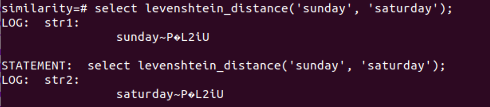

        我们发现在字符串后面加上了不需要的内容，因此需要另寻出路。在研究 text 结构的时候我们发现了 `text_to_cstring()` 函数，于是转而采用此函数实现将`text`的转化，代码如下

        ```c
        text * str_01 = PG_GETARG_DATUM(0);
        text *txt_02 = PG_GETARG_DATUM(1);
        int32 result=1;
        char *str1 = text_to_cstring(str_01);
        char *str2 = text_to_cstring(txt_02);
        int len_1 = strlen(str1);
        int len_2 = strlen(str2);
        ```

3. 代码解释
    - 代码总览

        ```c
        int min(int a, int b, int c){
            int reslut = a;
            if ( a > b){
                reslut = b;
                if (b > c)
                    reslut = c;
            }
            else if(a > c)
                reslut = c;
            return reslut;
        }

        char TOLOWER(char c){
            if(c >= 'A' && c <= 'Z')
                c += 32;
            return c;
        }

        Datum levenshtein_distance(PG_FUNCTION_ARGS){
            text * str_01 = PG_GETARG_DATUM(0);
            text *txt_02 = PG_GETARG_DATUM(1);
            int32 result=1;
            // text to char c
            char *str1 = text_to_cstring(str_01);
            char *str2 = text_to_cstring(txt_02);
            int len_1 = strlen(str1);
            int len_2 = strlen(str2);
            int table[256][256];
            int i, j;
            elog(LOG, "str1:\n\t%s\n", str1);
            elog(LOG, "str2:\n\t%s\n", str2);
            elog(LOG, "len1:\n\t%d\n", len_1);
            elog(LOG, "len2:\n\t%d\n", len_2);
            for(i = 1;i <= len_1; ++i)
                table[i][0] = i;
            for(i = 1; i <= len_2; ++i)
                table[0][i] = i;
            for(j = 1; j <= len_2; ++j )
                for(i = 1; i <= len_1; ++i){
                    if(TOLOWER(str1[i-1]) == TOLOWER(str2[j-1]))
                        table[i][j] = table[i-1][j-1];
                    else
                        table[i][j] = min(table[i-1][j-1], table[i-1][j], table[i][j-1]) + 1;
                }
            result = table[len_1][len_2];
            PG_RETURN_INT32(result);
        }
        ```

    - 功能说明
        - `int min(int a, int b, int c)`
            用来计算三者中最小值
        - `char TOLOWER(char c)`
            用来讲大写字符转换成小写，即实现了大小写不敏感对需求。在之后的 Jaccard Index 中我们也会用到这个函数
        - `Datum levenshtein_distance(PG_FUNCTION_ARGS)`
            Levenshtein Distance 算法核心部分
4. 结果展示
    - `select levenshtein_distance('sunday', 'sunday');`
        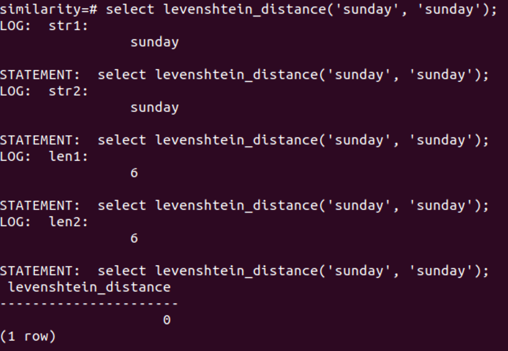
    - `select levenshtein_distance('sunday', 'Monday'); levenshtein_distance`
        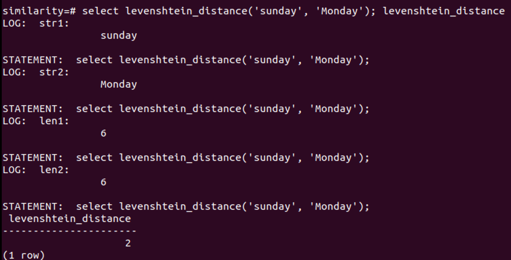
    - `select levenshtein_distance('sunday', 'saturday');`
        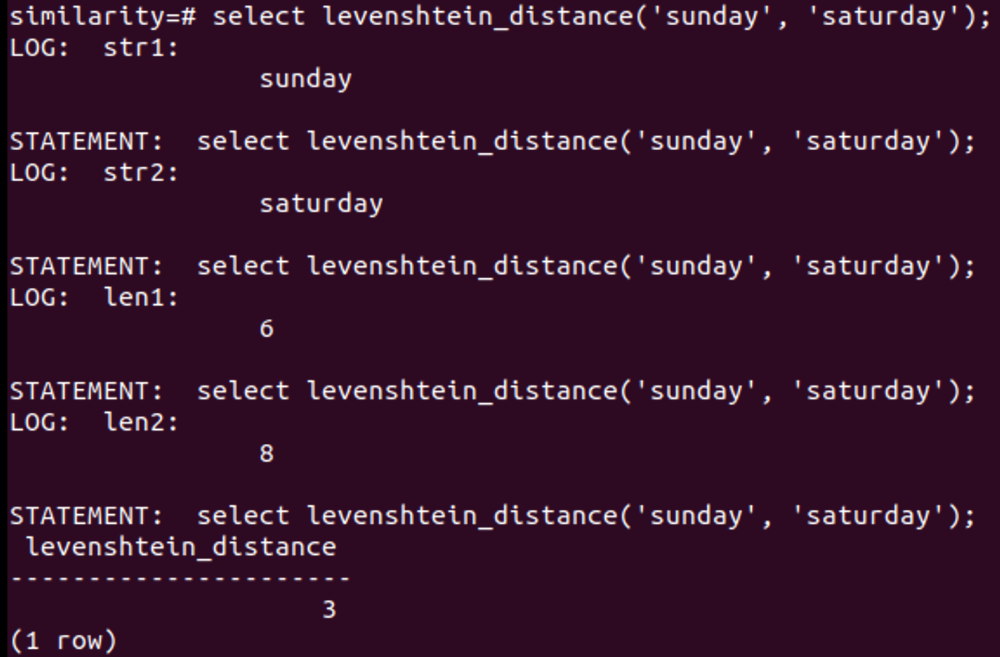
    - `select count(*) from restaurantphone rp, addressphone ap where levenshtein_distance(rp.phone, ap.phone) < 4;`
        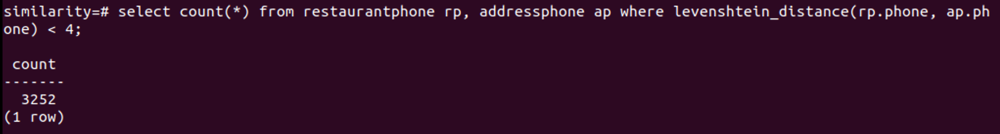
    - `select count(*) from restaurantaddress ra, restaurantphone rp where levenshtein_distance(ra. name, rp. name) < 3;`
        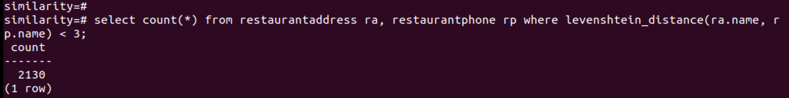
    - `select count(*) from restaurantaddress ra, addressphone ap where levenshtein_distance(ra.address, ap.address) < 4;`
        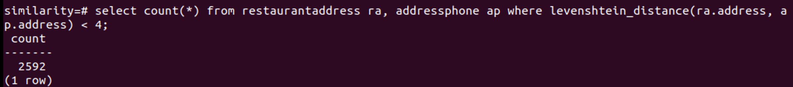
    -   ```sql
        SELECT ra.address, ap.address, ra.name, ap.phone
        FROM restaurantaddress ra, addressphone ap
        WHERE levenshtein_distance(ra.address, ap.address) < 4 AND
            (ap.address LIKE '%Berkeley%' OR ap.address LIKE '%Oakland%') ORDER BY 1, 2, 3, 4;
        ```
        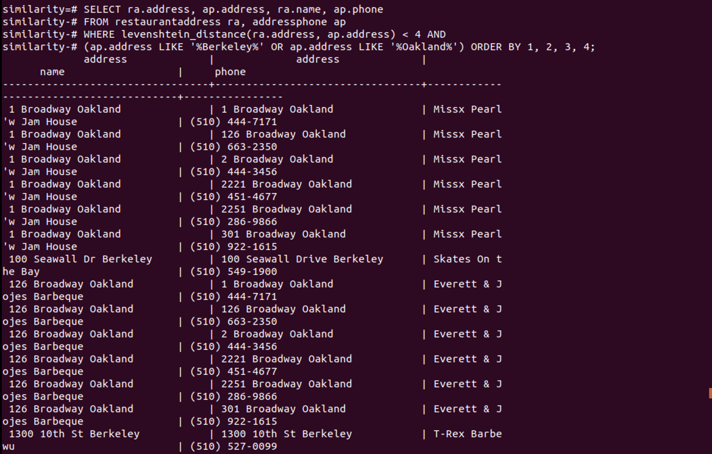
        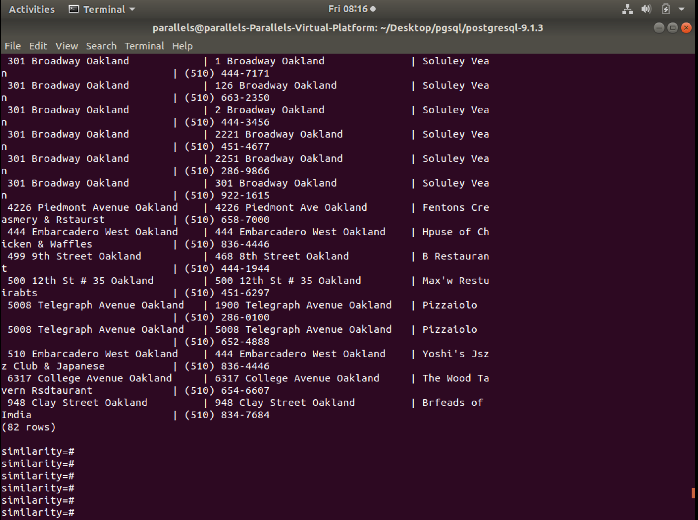

### Jaccard Index

Jaccard相似指数用来度量两个集合之间的相似性，它被定义为两个集合交集的元素个数除以并集的元素个数。
The Jaccard index, also known as Intersection over Union and the Jaccard similarity coefficient (originally given the French name coefficient de communauté by Paul Jaccard), is a statistic used for gauging the similarity and diversity of sample sets. The Jaccard coefficient measures similarity between finite sample sets, and is defined as the size of the intersection divided by the size of the union of the sample sets:
$J(A,B) = {{|A \cap B|}\over{|A \cup B|}} = {{|A \cap B|}\over{|A| + |B| - |A \cap B|}}$
(If $A$ and $B$ are both empty, define $J(A,B) = 1$.)
$0\le J(A,B)\le 1$

3. 代码解释

    ```c
    int getbiagram(char *str, int *tag){
        int i, j, len = strlen(str), result = 1;
        tag[0] = -1;
        for (i = 1; i < 256; i++)
            tag[i] = -3;
        for (i = 0; i < len - 1; i++){
            for (j = 1; j < result; j++)
                if ((TOLOWER(str[i]) == TOLOWER(str[tag[j]])) && (TOLOWER(str[i + 1]) == TOLOWER(str[tag[j] + 1])))
                    break;
            if (j == result) 
                tag[result++] = i;
        }
        tag[result++] = -2;
        return result;
    }

    int inter(char *str1, char *str2, int *tag1, int *tag2){
        int i, j, cnt = 0;
        for (i = 0; i < 256 && tag1[i] != -3; i++){
            if (tag1[i] == -1)
                cnt += (TOLOWER(str1[0]) == TOLOWER(str2[0]) ? 1 : 0);
            else if (tag1[i] == -2)
                cnt += (TOLOWER(str1[strlen(str1) - 1]) == TOLOWER(str2[strlen(str2) - 1]) ? 1 : 0);
            else{
                for (j = 1; j < 256 && tag2[j] != -2; j++){
                    if ((TOLOWER(str1[tag1[i]]) == TOLOWER(str2[tag2[j]])) && (TOLOWER(str1[tag1[i] + 1]) == TOLOWER(str2[tag2[j] + 1])))
                        break;
                }
                if (tag2[j] != -2 && tag2[j] != -3)
                    cnt++;
            }
        }
        return cnt;
    }

    Datum jaccard_index(PG_FUNCTION_ARGS)
    {
        text *str_01 = PG_GETARG_DATUM(0);
        text *txt_02 = PG_GETARG_DATUM(1);
        char* str1 = text_to_cstring(str_01);
        char* str2 = text_to_cstring(txt_02);
        int tag1[256], cnt_1;
        int tag2[256], cnt_2;
        cnt_1 = getbiagram(str1, tag1);
        cnt_2 = getbiagram(str2, tag2);
        int insec = inter(str1, str2, tag1, tag2);
        float result = (float)insec / (cnt_1 + cnt_2 - insec);
        PG_RETURN_FLOAT4(result);
    }
    ```

1. 结果展示
    - `select count(*) from restaurantphone rp, addressphone ap where jaccard_index(rp.phone, ap.phone) > .6;`
        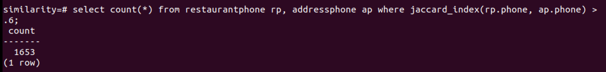
    - `select count(*) from restaurantaddress ra, restaurantphone rp where jaccard_index(ra.name, rp.name) > .65;`
        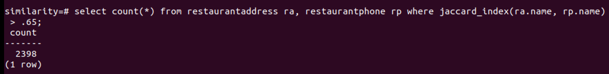
    - `select count(*) from restaurantaddress ra, addressphone ap where jaccard_index(ra.address, ap.address) > .8;`
        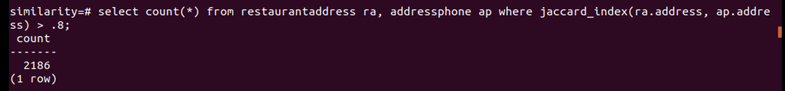
    - ```sql
      SELECT rp.phone, ap.phone, rp.name, ap.address
      FROM restaurantphone rp, addressphone ap
      WHERE jaccard_index(rp.phone, ap.phone) > .6 AND
          (ap.address LIKE '% Berkeley%' OR ap.address LIKE '% Oakland %') ORDER BY 1, 2, 3, 4;
      ```
      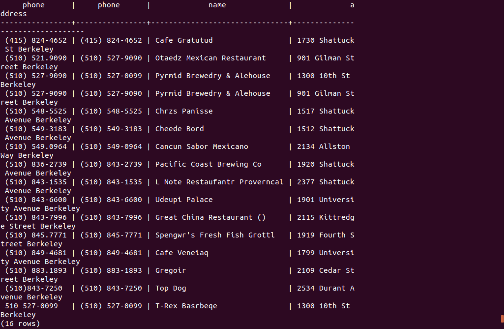
